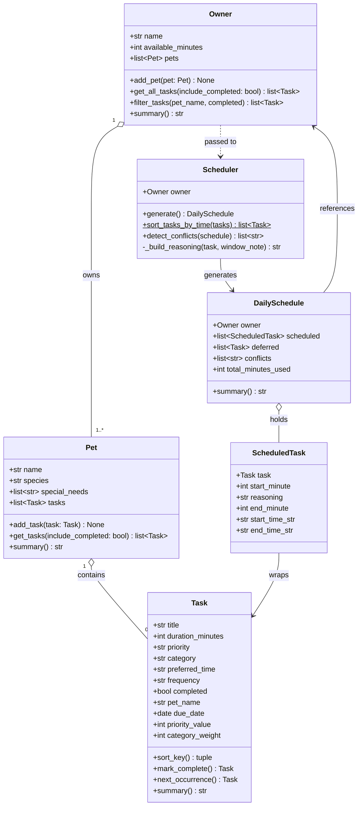

# PawPal+ UML Class Diagram

## Relationship notes

| Arrow | Meaning |
|-------|---------|
| `o--` | Aggregation — Pet owns its Tasks; Owner owns its Pets |
| `-->` | Directed association — Scheduler produces DailySchedule; ScheduledTask wraps a Task |
| `..>` | Dependency — Scheduler receives an Owner but doesn't own it |

## Key changes from the Phase 1 draft

- Added `ScheduledTask` class (missing entirely from the original diagram).
- Expanded all classes with their full attributes and methods.
- Replaced the ambiguous `Pet --> Scheduler` / `Task --> Scheduler` arrows with the correct `Owner ..> Scheduler` dependency (Scheduler talks to Owner, not directly to Pet/Task).
- Added `DailySchedule.conflicts` list — populated by `detect_conflicts()`.
- Marked `sort_tasks_by_time` with `$` to indicate it is a static method.
