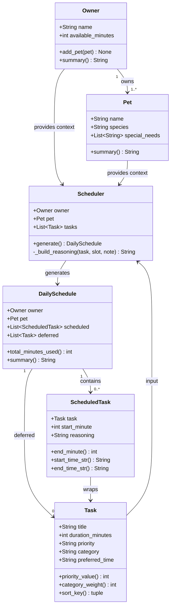

# PawPal+ UML Class Diagram

```mermaid
classDiagram
    class Owner {
        +String name
        +int available_minutes
        +add_pet(pet) None
        +summary() String
    }

    class Pet {
        +String name
        +String species
        +List~String~ special_needs
        +summary() String
    }

    class Task {
        +String title
        +int duration_minutes
        +String priority
        +String category
        +String preferred_time
        +priority_value() int
        +category_weight() int
        +sort_key() tuple
    }

    class Scheduler {
        +Owner owner
        +Pet pet
        +List~Task~ tasks
        +generate() DailySchedule
        -_build_reasoning(task, slot, note) String
    }

    class ScheduledTask {
        +Task task
        +int start_minute
        +String reasoning
        +end_minute() int
        +start_time_str() String
        +end_time_str() String
    }

    class DailySchedule {
        +Owner owner
        +Pet pet
        +List~ScheduledTask~ scheduled
        +List~Task~ deferred
        +total_minutes_used() int
        +summary() String
    }

    Owner "1" --> "1..*" Pet : owns
    Owner --> Scheduler : provides context
    Pet --> Scheduler : provides context
    Task --> Scheduler : input
    Scheduler --> DailySchedule : generates
    DailySchedule "1" --> "0..*" ScheduledTask : contains
    DailySchedule "1" --> "0..*" Task : deferred
    ScheduledTask --> Task : wraps
```
